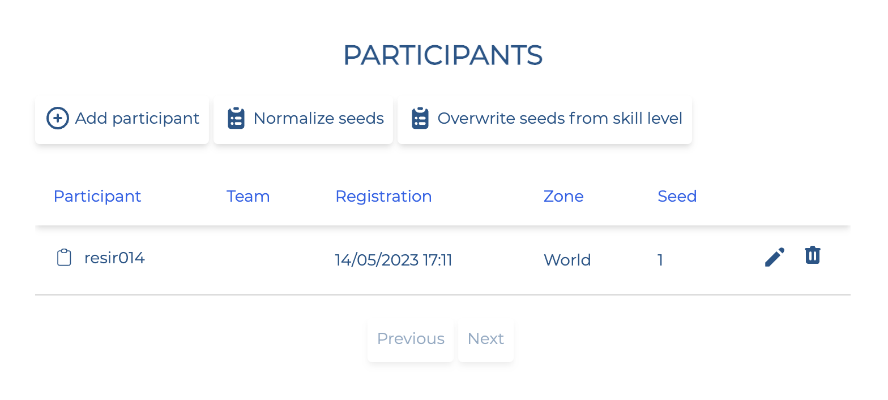

# Adding players & teams

As a competition administrator, you have the ability to add/remove players/teams.

## Adding a player

Click on the "Participants" menu on the left sidebar and you will be redirected to this page.

This is where all the participants in your competitions are listed. You can add/remove players, manually set a seed, as well as automatically determining seeds for all players based on their skill level.

Click on "Add participant" to add a player. Then, insert the Account ID of the player, and the designated role. You can look up for a certain player's Account ID by going to [trackmania.io](https://trackmania.io) and searching for their username.

## Adding teams

Since registrations are handled manually for Team events, you will have to manually add teams competing in your competition by yourself. Click the "Teams" menu on the left sidebar and you will be redirected to this page.

Click on "Add team" to add a team. Insert the name of the team, and a seed (if any).

Then, insert the Account ID of the player, and the designated role. You can look up for a certain player's Account ID by going to [trackmania.io](https://trackmania.io) and searching for their username.
