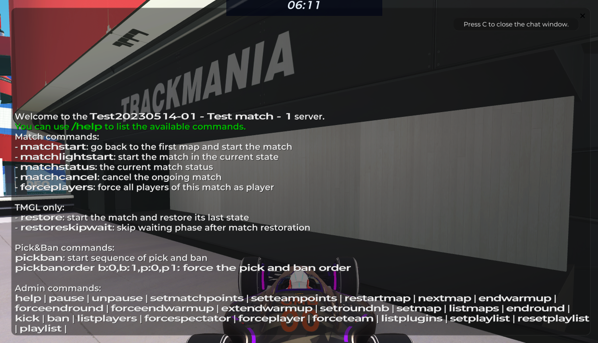

# Server commands

Below is a list of commands that are useful for general administration. Of course, you can always type `/help` in the server chat to see a list of all the commands available to you.

!!! warning "Warning"

    The list below is incomplete. Use `/help` in a match server to see all the available commands.

## Match commands

- `/matchstart` - Reset the track playlist and start the match.
- `/matchlightstart` - Start the match in the current state.
- `/matchstatus` - View the current match status.
- `/matchcancel` - Cancel the ongoing match.
- `/forceplayers` - Force everyone in the server as a player.

## Pick & Ban commands

- `/pickban` - Start the pick & ban phase.
- `/pickbanorder [order]` - Force a specific pick/ban order on a match server. (e.g.&nbsp;`/pickbanorder b:0,b:1,p:0,p:1`)

## Administrative commands

- `/help` - Shows a list of all commands. Use `/help [commandname]` (e.g. `/help setmatchpoints`) to read a usage guide on the requested command.
- `/pause` - Skips any ongoing round and activates the pause procedure.
- `/unpause` - Resumes the match.
- `/forceendround` - Ends the ongoing round.
- `/forceendwarmup` - Ends the ongound warmup.
- `/listmaps` - Lists the maps played in the current match.
- `/forcespectator [username]` - Forces a server member as a spectator.
- `/forceplayer [username]` - Forces a server member as a player.
