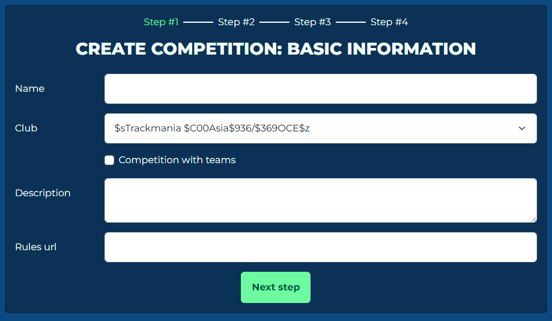
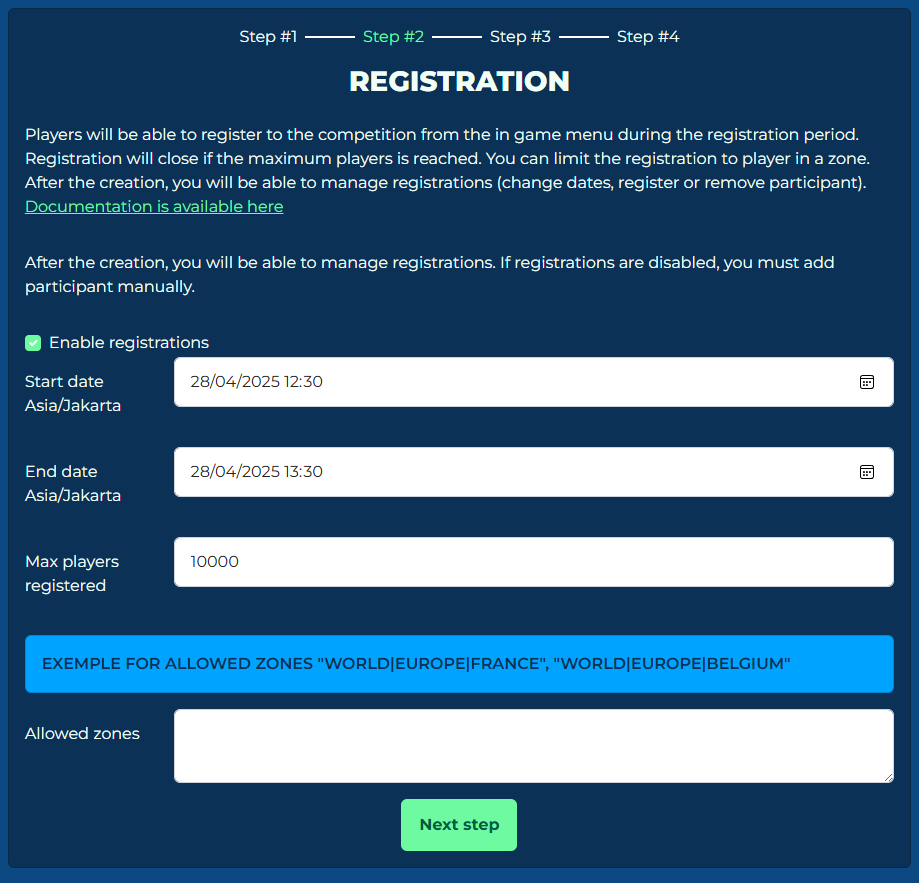

# Creating a competition

!!! info "Club permissions"

    In order to create and manage Competitions for a club you must either have the **Creator**, **Admin** or **Content Creator** role for that club.

To create a Competition activity, you need to visit the [Competition Tool website](https://admin.trackmania.nadeo.club/). To get started, log in to the Competition Tool using your Ubisoft account, and then click on "Create Competition."

## Basic Information

When you click on "Create Competition," you will be taken to a form where you can enter the basic information about your competition. This is the first step in the competition creation process.



The form will include the following fields:

- **Name:** Enter the name of your competition in this field.
- **Club:** A competition *must* be associated with a club. Use the dropdown list to select the club you want to link the competition to.
- **Description:** This is an optional field. If you want, you can provide a description for your competition that will appear on the Event page in-game. This field supports [Trackmania's custom text formatting](https://wiki.trackmania.io/en/content-creation/text-styling).
- **Rules:** If your competition has a rulebook, you can link to it in this field. If you include a rulebook, players will need to tick a checkbox indicating that they agree to the competition rules before they can register.

!!! info "Club competitions and Events menu"

    To make your Competition visible through the **Play > Live > Events** menu by default, the Club linked to the competition must have a "Verified" status. You can request verification for your Club by visiting the Club's Admin page. To view a list of the clubs you own or are a member of, click on [this link](https://www.trackmania.com/player/clubs).

    However, if the Club tied to the competition is not verified, you can still find the competition by using the search box and manually looking for the event.

### Team competitions

To create a Team competition, you can tick the "Competition with teams" checkbox. This will set the upcoming steps of the competition creation process to accomodate Team competitions.

## Registrations

On the next step, you will input regisration details, should you want to open registrations for your event. If you would like to manually register players into your event, uncheck the "Enable registrations" toggle switch and follow [this guide](../administration/players-teams.md) to manually add players.

!!! warning "Registrations unavailable for Team competitions"

    Registrations are handled manually on Team competitions, as there is no in-game registration for Team competitions. You will have to manually add teams and players using the [Teams menu](../administration/players-teams.md).

    To handle registrations for Team competitions, you can use third-party tools like [Challonge](https://challonge.com/) or [Toornament](https://www.toornament.com/).



This section of the form includes the following fields:

- **Start date:** Enter the date when registration starts in your *local time*.
- **End date:** Enter the date when registration ends in your *local time*.
- **Maximum players registered:** If your competition has an upper limit for number of players registered, change this option. If not, then leave this setting as it is.
- **Allowed zones:** This is used to limit registrations of the competitions to certain regions (see examples below). List all the [zone strings](../zones/index.md) allowed to register for the event, separated by commas. Leaving it blank will open registrations to players around the world.

You can change registration times any time after your competition has been created.

!!! example "Examples for allowed zones"

    To limit registration to the entire Asia and Oceania continent:

    ```
    World|Asia, World|Oceania
    ```

    To limit registrations to France, Belgium, Monaco, and Switzerland:

    ```
    World|Europe|France, World|Europe|Belgium, World|Europe|Monaco, World|Europe|Switzerland
    ```

## What's next

In the next section, you will learn how to add qualifiers and rounds to your competition.
