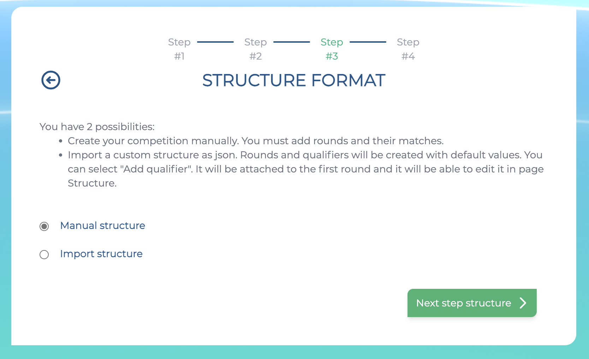
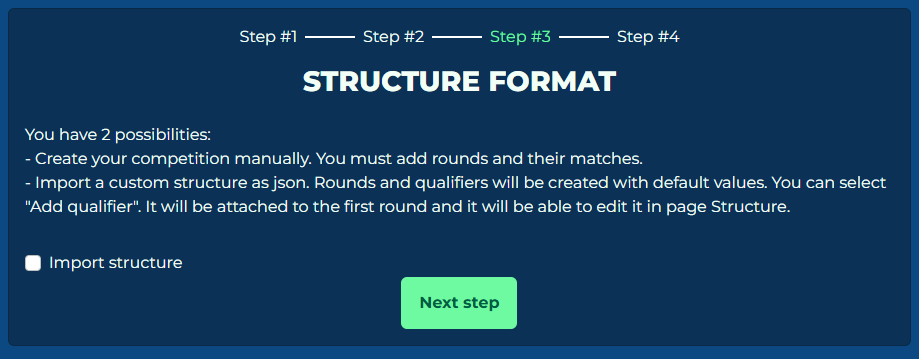
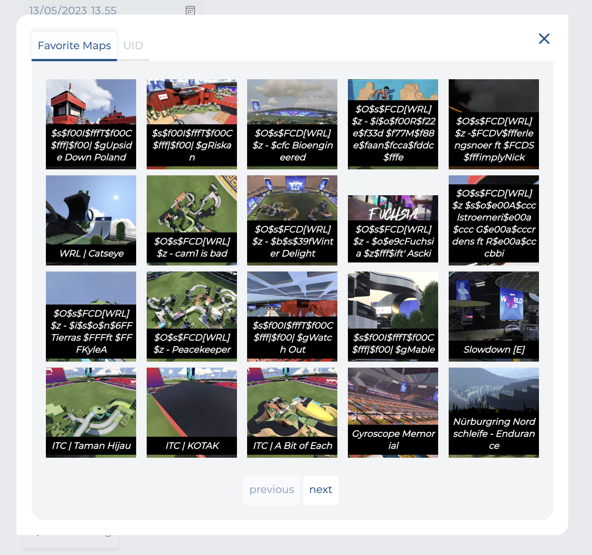

# Adding a qualifier

!!! info

    Qualifier rounds are only available on Solo competitions.

A qualifier (also known as a round challenge) is the phase of a competition to determine the seeding of a player. The seeding will be determined based on the placements the players received during a qualifier.

This can be used to determine if a player will qualify to the bracket phase of a competition.

If your competition does not have a qualifier phase, you can skip this step.

## Create a qualifier

In this section, we will create a qualifier using the manual structure editor in the competition tool. If you would like to use the structure importer, go to [this page](./structure-importer.md).

Click on "Add qualifier" and you will be redirected to this screen.

This is the first section of the Add qualifier screen. It contains the following fields:

- **Name:** The name of your qualifier round.
- **Start date:** Enter the date when qualifier starts in your *local time*.
- **End date:** Enter the date when qualifier ends in your *local time*.
- **Leaderboard score:** The scoring system used to determine placements during a qualifier. [Click here](#leaderboard-score) to read about what the different scoring systems mean.
- **Script:** The gamemode (script) used for the qualifier round. Only **Time Attack** is available for qualifier rounds.
- **Max players:** The maximum amount of players available in a server. Around 30 minutes before the start of a qualifier, the system will automatically create servers based on the number of players registered compared to the number of max players in a server.

!!! important

    You can alter all the dates & times after creation, including the rounds and registration times. However, **please take note of the following limitations**:

    - Any round has to have a start date that's later than the previous round's end date.
    - You also can't have two rounds running at the same time.

## Adding maps

The next section of the form will allow you to add maps for the qualifier round.

You can add maps in one of two ways:

- Adding them from your in-game favourites
- Manually adding map via a specific unique ID

!!! important

    You can only select maps that have been [uploaded to Nadeo's servers](../../activities/campaign.md#adding-maps).

    Uploading a map to Nadeo's servers will give it a unique ID, which you can look up by going to [trackmania.io](https://trackmania.io/).

    As always, you can add a map to your in-game favourites and add the map that way.

Maps will be played in the order which they were added. As always, you can change the order of a map playlist within the competition tool.

!!! tip

    The map playlist will be automatically reset before the start of each round.

    If you would like to add a "waiting room" map for a competition round, you can enter it as the first map on the playlist, then *immediately* remove it between when the servers were created and before the round starts.

## Settings

The next section allows you to modify settings for the script (game mode) and the server plugin.

- **Script settings:** Modify the settings for the Time Attack mode used for the qualifier. [See here](https://wiki.trackmania.io/en/dedicated-server/Usage/OfficialGameModesSettings) for a reference on all the available script settings.
- **Plugin settings:** Modify the settings for the Competition management plugin. [See here](../plugin-settings.md) for a reference on all the available plugin settings.

## Leaderboard score

To determine placements for a qualifier, you can choose between multiple scoring systems.

### Skillpoints

This is the default and recommended scoring system, which utilises skill points. Skill points are given per map, and the total skill points from all qualifier maps will be used to determine placements. Higher skill points from will mean higher placement.

The following skill points are given based on the player's rank on any given map:

| Position | Points |
|:---:|:---:|
| 1 | 40,000 points |
| 2 | 28,000 points |
| 3 | 24,000 points |
| 4 | 20,000 points |
| 5 | 18,000 points |
| 6 | 16,000 points |
| 7 | 14,000 points |
| 8 | 12,000 points |
| 9 | 10,000 points |
| 10 | 10,000 points |
| 11 | 8,000 points |
| 12 | 8,000 points |
| 13 | 6,000 points |
| 14 | 6,000 points |
| 15 | 4,000 points |
| 16 | 4,000 points |
| 17-100 | (20,000 / rank + 1,800) points |
| 101-1000 | (100,000 / rank + 900) points |
| 1001-10000 | (500,000 / rank + 450) points |
| 10001-100000 | (2,500,000 / rank + 225) points |

!!! example "More examples"

    - Rank 20: **2800 points**
    - Rank 80: **2050 points**
    - Rank 101: **1890 points**
    - Rank 999: **1000 points**
    - Rank 1,001: **949 points**
    - Rank 9,999: **500 points**
    - Rank 10,001: **474 points**
    - Rank 100,000: **250 points**

### Ranks

This scoring system uses the sum players' ranks from each map in the qualifier to determine the placements. Lower total ranks will mean higher placement.

### Times

This scoring system uses players' total times from each map in the qualifier to determine the placements.
