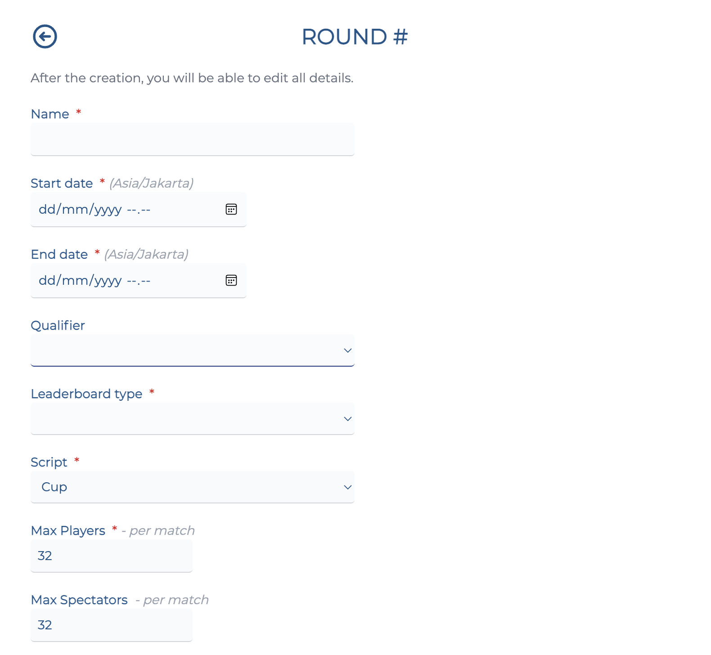
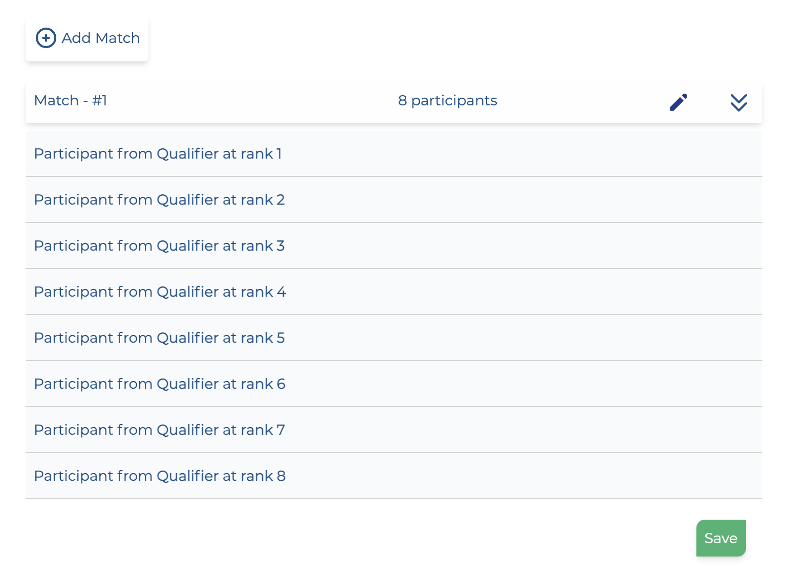

# Adding rounds

In this section, we will create a round using the manual structure editor in the competition tool. If you would like to use the structure importer, go to [this page](./structure-importer.md).

## Create a round

If you just finished creating a qualifier from the [previous section](./qualifier.md), you will be automatically redirected to the round creation screen. Otherwise, click on "Add round" and you will be redirected to this screen.

This is the first section of the Add round screen. It contains the following fields:

- **Name:** The name of your round.
- **Start date:** Enter the date when the round starts in your *local time*.
- **End date:** Enter the date when the round ends in your *local time*.
- **Qualifier:** If your round has a qualifier, select the qualifier round it's tied to.
- **Script:** The gamemode (script) used for the round.
- **Max players:** The maximum amount of players available in a server.
- **Max spectators:** The maximum amount of spectators available in a server. [Click here](../administration/spectators.md) to learn more on how to add spectators.

!!! important

    You can alter all the dates & times after creation, including the rounds and registration times. However, **please take note of the following limitations**:

    - Any round has to have a start date that's later than the previous round's end date.
    - You also can't have two rounds running at the same time.

## Adding maps

The next section of the form will allow you to add maps for the round.

You can add maps in one of two ways:

- Adding them from your in-game favourites
- Manually adding map via a specific unique ID

!!! important

    You can only select maps that have been [uploaded to Nadeo's servers](../../activities/campaign.md#adding-maps).

    Uploading a map to Nadeo's servers will give it a unique ID, which you can look up by going to [trackmania.io](https://trackmania.io/).

    As always, you can add a map to your in-game favourites and add the map that way.

Maps will be played in the order which they were added. As always, you can change the order of a map playlist within the competition tool.

If your competition has a Pick & Ban phase, this will list all the maps available to pick/ban.

!!! tip

    The map playlist will be automatically reset before the start of each round.

    If you would like to add a "waiting room" map for a competition round, you can enter it as the first map on the playlist, then *immediately* remove it between when the servers were created and before the round starts.

## Settings

The next section allows you to modify settings for the script (game mode) and the server plugin.

- **Script settings:** Modify the settings for the Time Attack mode used for the qualifier. [See here](https://wiki.trackmania.io/en/dedicated-server/Usage/OfficialGameModesSettings) for a reference on all the available script settings.
- **Plugin settings:** Modify the settings for the Competition management plugin. [See here](../plugin-settings.md) for a reference on all the available plugin settings.

## Adding matches

After creating your round, you will be redirected to the match creation screen. This will allow you to add matches for the round.

Click "Add match" to add a new match.

Here you can add participants for each match. They can come from different sources:

- Results from a qualifier.
- Results from a previous round match.
- Registered participants with a seed. You will be able to set the seed for each participant from the [Players page](../administration/players-teams.md) after creating the event.
- Registered participants with a rank from this competition leaderboard

After adding a match, you can review the participants on each match by expanding/collapsing them.

Click "Save". You will then be able to review all your competition's rounds and their structure.

Once you're happy with how your rounds are structured, click "Create".

Congratulations, your competition is created!

## What's next

- If you would like to learn about importing a preset structure for your competition, go to [Structure importer](./structure-importer.md).
- Otherwise, [click here](../administration/index.md) to learn more about what you can do as a competition administrator.
