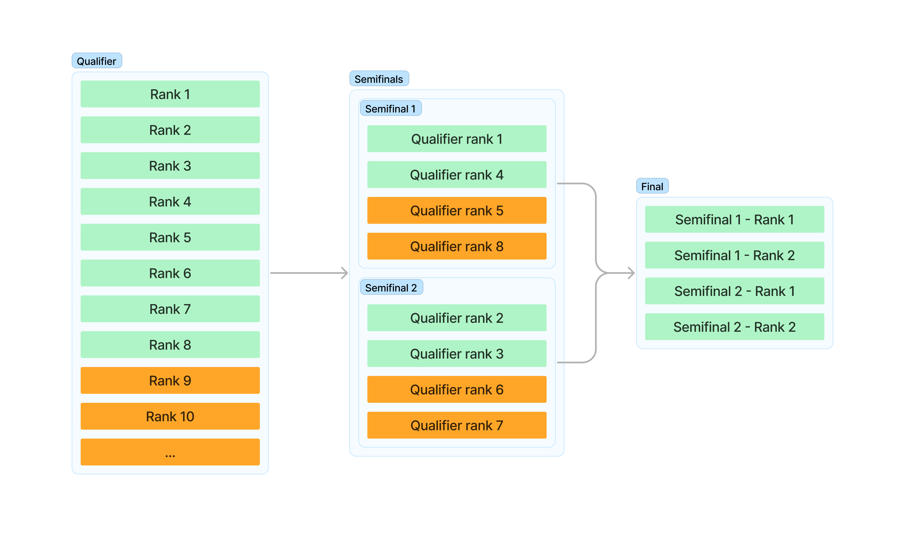
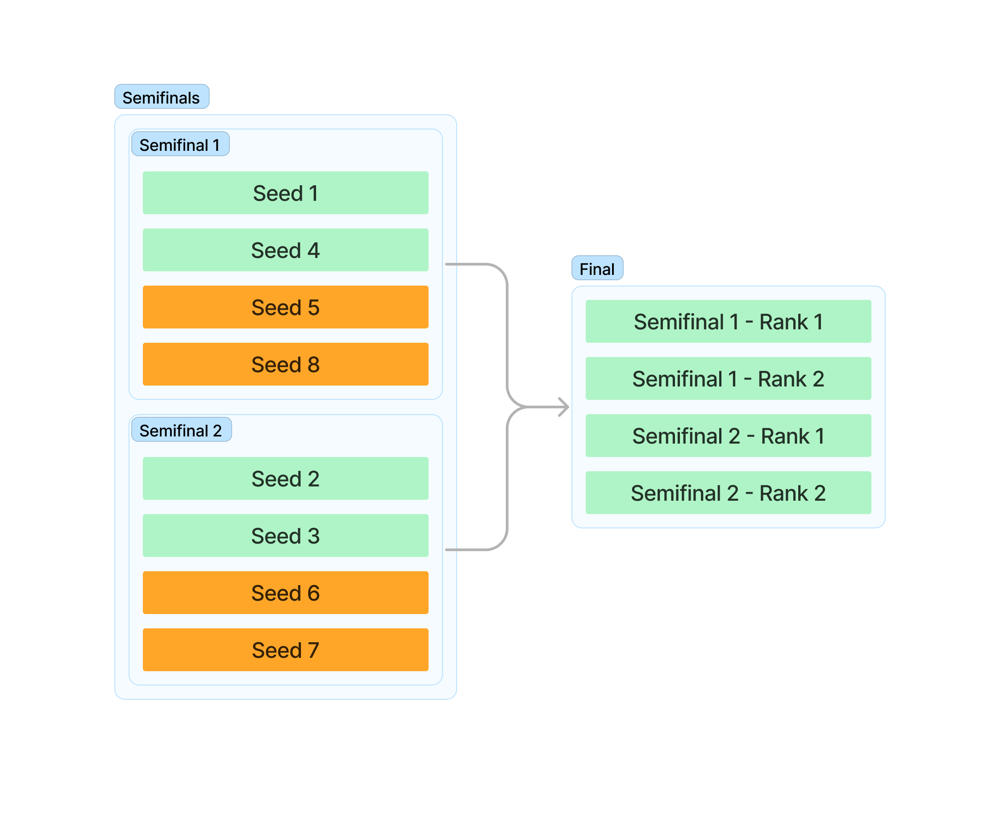

# Examples (Solo competitions)

Below are a few structure examples for Solo competitions that you can use as a starting point for your competition.

## Single elimination bracket

Let's say you have a bracket that looks like this:



We can then map how this will be laid out as a structure in the competition tool.

!!! example "Stucture of the above bracket"

    - Round 1 - Semifinal - participants are added from the qualifier which is attached to this round
        - Match 1
            - Participant of qualifier at rank 1
            - Participant of qualifier at rank 4
            - Participant of qualifier at rank 5
            - Participant of qualifier at rank 8
        - Match 2
            - Participant of qualifier at rank 2
            - Participant of qualifier at rank 3
            - Participant of qualifier at rank 6
            - Participant of qualifier at rank 8
    - Round 2 - Final - participants are added from the previous round (round 1)
        - Match 1
            - Participant of the round 1 and match 1 at rank 1
            - Participant of the round 1 and match 1 at rank 2
            - Participant of the round 1 and match 2 at rank 1
            - Participant of the round 1 and match 2 at rank 2

Therefore, our structure is like this.

```json
{
  "version": 1,
  "rounds": [
    {
      "name": "round 1",
      "matchGeneratorType": "spot_filler",
      "matchGeneratorData": {
        "matches": [
          {
            "spots": [
              {
                "spotType": "round_challenge_participant",
                "roundPosition": 0,
                "rank": 1
              },
              {
                "spotType": "round_challenge_participant",
                "roundPosition": 0,
                "rank": 4
              },
              {
                "spotType": "round_challenge_participant",
                "roundPosition": 0,
                "rank": 5
              },
              {
                "spotType": "round_challenge_participant",
                "roundPosition": 0,
                "rank": 8
              }
            ]
          },
          {
            "spots": [
              {
                "spotType": "round_challenge_participant",
                "roundPosition": 0,
                "rank": 2
              },
              {
                "spotType": "round_challenge_participant",
                "roundPosition": 0,
                "rank": 3
              },
              {
                "spotType": "round_challenge_participant",
                "roundPosition": 0,
                "rank": 6
              },
              {
                "spotType": "round_challenge_participant",
                "roundPosition": 0,
                "rank": 7
              }
            ]
          }
        ]
      }
    },
    {
      "name": "round 2",
      "matchGeneratorType": "spot_filler",
      "matchGeneratorData": {
        "matches": [
          {
            "spots": [
              {
                "spotType": "match_participant",
                "roundPosition": 0,
                "matchPosition": 0,
                "rank": 1
              },
              {
                "spotType": "match_participant",
                "roundPosition": 0,
                "matchPosition": 0,
                "rank": 2
              },
              {
                "spotType": "match_participant",
                "roundPosition": 0,
                "matchPosition": 1,
                "rank": 1
              },
              {
                "spotType": "match_participant",
                "roundPosition": 0,
                "matchPosition": 1,
                "rank": 2
              }
            ]
          }
        ]
      }
    }
  ]
}
```

### Single elimination bracket without qualifier

The same bracket above can also be applied to competitions without a qualifier. Instead of using a `spotType` of `round_challenge_participant` for round 1, we use `competition_participant` and manually set a seed for each participant in the Participants menu.



```json
{
  "version": 1,
  "rounds": [
    {
      "name": "round 1",
      "matchGeneratorType": "spot_filler",
      "matchGeneratorData": {
        "matches": [
          {
            "spots": [
              {
                "spotType": "competition_participant",
                "seed": 1
              },
              {
                "spotType": "competition_participant",
                "seed": 4
              },
              {
                "spotType": "competition_participant",
                "seed": 5
              },
              {
                "spotType": "competition_participant",
                "seed": 8
              }
            ]
          },
          {
            "spots": [
              {
                "spotType": "competition_participant",
                "seed": 2
              },
              {
                "spotType": "competition_participant",
                "seed": 3
              },
              {
                "spotType": "competition_participant",
                "seed": 6
              },
              {
                "spotType": "competition_participant",
                "seed": 7
              }
            ]
          }
        ]
      }
    },
    {
      "name": "round 2",
      "matchGeneratorType": "spot_filler",
      "matchGeneratorData": {
        "matches": [
          {
            "spots": [
              {
                "spotType": "match_participant",
                "roundPosition": 0,
                "matchPosition": 0,
                "rank": 1
              },
              {
                "spotType": "match_participant",
                "roundPosition": 0,
                "matchPosition": 0,
                "rank": 2
              },
              {
                "spotType": "match_participant",
                "roundPosition": 0,
                "matchPosition": 1,
                "rank": 1
              },
              {
                "spotType": "match_participant",
                "roundPosition": 0,
                "matchPosition": 1,
                "rank": 2
              }
            ]
          }
        ]
      }
    }
  ]
}
```

## Championship

Used in a format where the same players play for multiple rounds within the same match, with results being counted from total points (similar to Formula 1).

Below is an example for a 3-round championship, where each round has 1 match, which contains 8 players. You can also add more rounds, matches and players.

```json
{
  "version": 1,
  "rounds": [
    {
      "name": "round 1",
      "matchGeneratorType": "spot_filler",
      "matchGeneratorData": {
        "matches": [
          {
            "spots": [
              {
                "spotType": "competition_participant",
                "seed": 1
              },
              {
                "spotType": "competition_participant",
                "seed": 2
              },
              {
                "spotType": "competition_participant",
                "seed": 3
              },
              {
                "spotType": "competition_participant",
                "seed": 4
              },
              {
                "spotType": "competition_participant",
                "seed": 5
              },
              {
                "spotType": "competition_participant",
                "seed": 6
              },
              {
                "spotType": "competition_participant",
                "seed": 7
              },
              {
                "spotType": "competition_participant",
                "seed": 8
              }
            ]
          }
        ]
      }
    },
    {
      "name": "round 2",
      "matchGeneratorType": "spot_filler",
      "matchGeneratorData": {
        "matches": [
          {
            "spots": [
              {
                "spotType": "match_participant",
                "roundPosition": 0,
                "matchPosition": 0,
                "rank": 1
              },
              {
                "spotType": "match_participant",
                "roundPosition": 0,
                "matchPosition": 0,
                "rank": 2
              },
              {
                "spotType": "match_participant",
                "roundPosition": 0,
                "matchPosition": 0,
                "rank": 3
              },
              {
                "spotType": "match_participant",
                "roundPosition": 0,
                "matchPosition": 0,
                "rank": 4
              },
              {
                "spotType": "match_participant",
                "roundPosition": 0,
                "matchPosition": 0,
                "rank": 5
              },
              {
                "spotType": "match_participant",
                "roundPosition": 0,
                "matchPosition": 0,
                "rank": 6
              },
              {
                "spotType": "match_participant",
                "roundPosition": 0,
                "matchPosition": 0,
                "rank": 7
              },
              {
                "spotType": "match_participant",
                "roundPosition": 0,
                "matchPosition": 0,
                "rank": 8
              }
            ]
          }
        ]
      }
    },
    {
      "name": "round 3",
      "matchGeneratorType": "spot_filler",
      "matchGeneratorData": {
        "matches": [
          {
            "spots": [
              {
                "spotType": "match_participant",
                "roundPosition": 1,
                "matchPosition": 0,
                "rank": 1
              },
              {
                "spotType": "match_participant",
                "roundPosition": 1,
                "matchPosition": 0,
                "rank": 2
              },
              {
                "spotType": "match_participant",
                "roundPosition": 1,
                "matchPosition": 0,
                "rank": 3
              },
              {
                "spotType": "match_participant",
                "roundPosition": 1,
                "matchPosition": 0,
                "rank": 4
              },
              {
                "spotType": "match_participant",
                "roundPosition": 1,
                "matchPosition": 0,
                "rank": 5
              },
              {
                "spotType": "match_participant",
                "roundPosition": 1,
                "matchPosition": 0,
                "rank": 6
              },
              {
                "spotType": "match_participant",
                "roundPosition": 1,
                "matchPosition": 0,
                "rank": 7
              },
              {
                "spotType": "match_participant",
                "roundPosition": 1,
                "matchPosition": 0,
                "rank": 8
              }
            ]
          }
        ]
      }
    }
  ]
}
```
