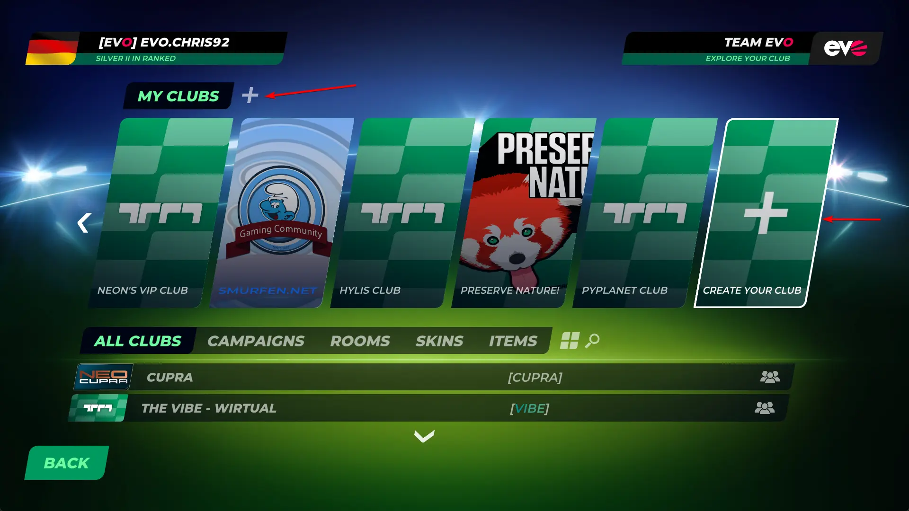

# How to create a club?

!!! info "Paid access required"

    This feature requires an active **Club Access** subscription.

To create a club, click on the `Clubs` option in the Main Menu and click on one of the two options as highlighted below.

Afterwards, follow the on-screen instructions to fill out the required information for your club.

## General Club settings

Here you can choose the name, club tag and description for your club, as well as its privacy. All of these fields can be changed later as well.

The privacy has three possible options:

- Public - Open to everyone: Everyone can join this club with no restrictions whatsoever. The most common option
- Private - Accept requests: Players can apply to join your club, but will not be able to join without your or a club admin's approval.
- Private: Nobody can join the club and nobody can apply to join the club either.

## Branding/Stadium settings

!!! info "Custom Assets require PC version"

    To upload custom images to your club, you need to create/edit your club from the PC version of Trackmania.

    Console and cloud versions are limited to a selection of default assets.

Here you can select/upload various branding related images for your club.

Templates for custom assets for both the Branding and Stadium related club customization options can be found [here](https://www.trackmania.com/media).

Author: [Chris92](https://twitter.com/Chris92_de)
