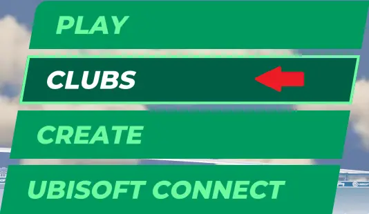

# How to join a club?

!!! info "Paid access required"

    This feature requires an active **Club Access** subscription.

Upon launching the game and finding yourself at the main menu, please navigate to the menu option labeled ***CLUBS*** and select this option.

After selecting the ***CLUBS*** option, you will be now be greeted with the Club Menu. This is the "homepage" for in-game clubs.

In the Club Menu, you will see a few different menu options and a scrollable list of in-game clubs. If you are able to find the club you wish to join by using the scrollable list provided, navigate to the club and then interact with the thumbnail. This will open the club page.

Alternatively, if you are unable to locate your club of choice, you can search for it directly by selecting this magnifying glass to open a search function. Here you can enter the name of the club you wish to search for.

Upon locating and entering the club page, you will see options for the club's different activities. In order to successfully join a club, you will need to navigate to and select the ***JOIN*** button at the top of the screen. 

*Note that some Clubs and Activities are private and will require acceptance from a Club Admin.*

Author: [XLRB](https://twitter.com/XLRB_)