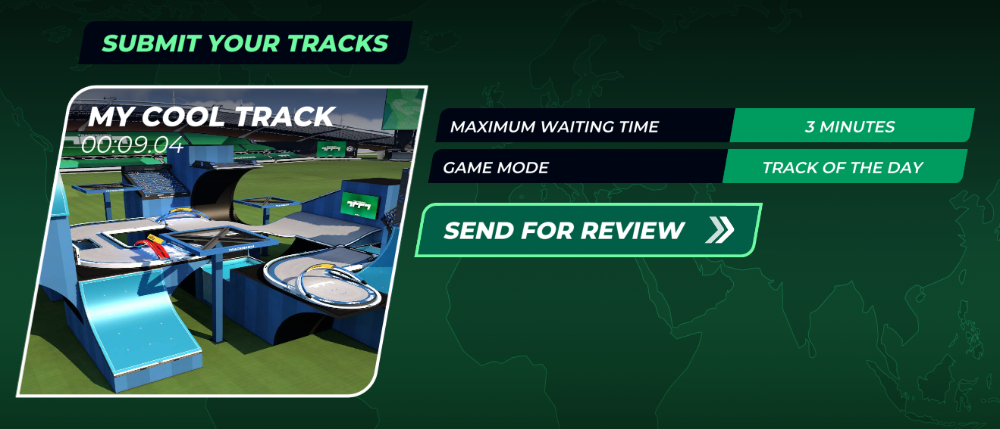
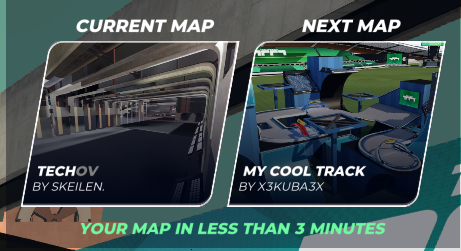

# Submit your map to map review

!!! info "Paid access required"

    This feature requires an active **Club Access** subscription.

You may submit your own **Race** type maps to Map Review to gain feedback and ratings from other players. Maps uploaded to Map Review may be chosen as **Tracks of the Day**, **Weekly Shorts** or **Weekly Grands**.

## Submit via the menu

In order to submit your map to Map Review, head to the **CREATE** tab. Select **TRACK REVIEW** then **SUBMIT YOUR TRACKS**. Depending on your map, you may choose either the **TRACK OF THE DAY** Map Review or **WEEKLY TRACKS** Map review (used for both Weekly Shorts and Weekly Grands).

Navigate through your local files and choose the map you wish to upload - you'll see a bunch of information regarding the waiting time for your map as well as the type of Map Review server you picked. 

Once you press the **SEND FOR REVIEW** button, you'll automatically join the Map Review server and your map will be queued. Leaving the server at any point will remove your map from the queue.

## Submit via the Track Editor

The track editor allows you to immediately jump into Map Review. Once you save a **validated** map that has **computed shadows**, a screen will pop up with the **LIVE TEST** options that will join Map Review and send your map to the queue.

