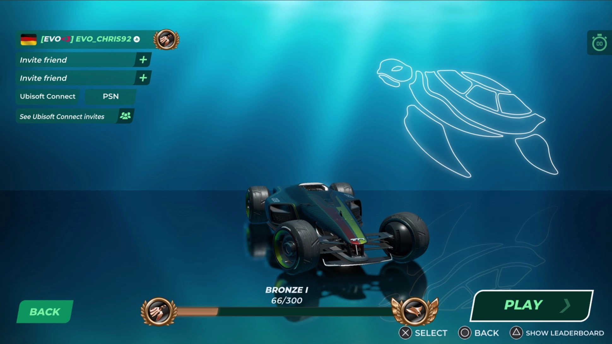

# How to play Ranked 2v2 with my friends?

To invite your friends to your 2v2 matchmaking session, head on over to the lobby screen that can be found under `Play -> Live -> Ranked`.

In the top left corner, you will have the option to either invite your friends or accept one of their invites.

Depending on the platform you play on, the invite options might look a little bit different. Pictured is the Lobby screen from the Playstation version of Trackmania.

## Communication with your party/team members

Trackmania features voice chat for communicating with your party and team mates in Ranked 3v3 matchmaking.
By default, Voice Chat is enabled and set to voice activation.
You can adjust the settings in the `Main Menu -> Settings -> Sound` or while you're playing in the `Pause menu -> Advanced -> Settings`.
A push-to-talk hotkey can be set in `Settings -> Inputs`.
You can also disable Voice Chat in case you do not feel like  communicating with others or are in a call on an external platform.

## Cross-platform play

In case you haven't disabled crossplay, you will be able to play with your friends no matter what platform they play on - your party could consist of a player on Playstation, a player on Xbox and a player on Luna or even on PC!

## Queueing for a match

Once your party is setup and ready to go, everyone in your party needs to press the Play button located in the bottom right of the screen. One thing to keep in mind though, to ensure fair matches, the maximum amount of gap in rating points between the best and the worst player in your party **must not** exceed 1000 points - the game will remind you of this in case you ever forget.

Author: [Chris92](https://twitter.com/Chris92_de)
