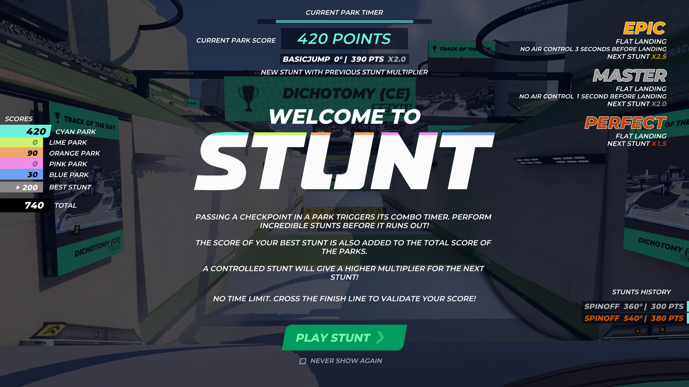
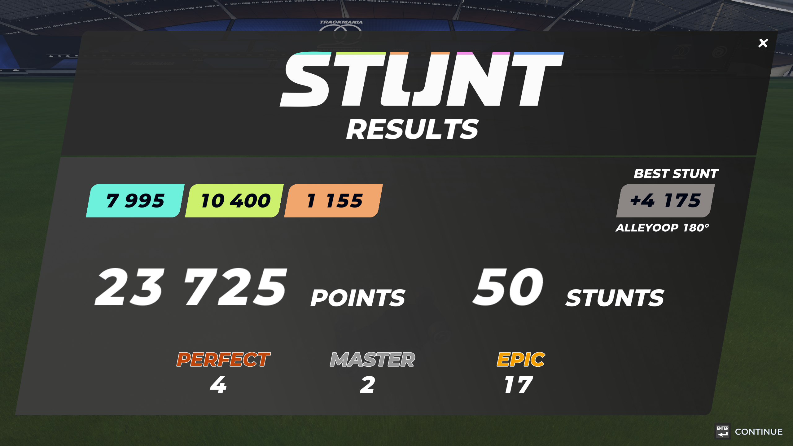

# Stunt Mode Explained

Being [announced](https://www.trackmania.com/news/8123) a few days beforehand, the July 1st, 2024 update alongside the Summer 2024 campaign season features a new game mode - Stunt. It comes with a new set of vibrant colors and a reimagined set of rules for the classic game mode. This document contains a rundown of the new gameplay elements and how to make the most use of them.

## The Concept

The Stunt mode is all about car control and the execution of various tricks - jumps, flips, corkscrews, 360 noscopes, etc. - perfectly. The longer you are in the air, the more you spin, the more wicked the trick is and the more points you are awarded. How those points are optimized and accumulated to produce your final score depends on a few different factors, explained below. The execution and discovery of various ways to play with the car mid-air is left as an exercise for the reader.

_The intro screen, shown after loading a Stunt track._

## Multipliers

The key element to making the most out of any trick is to ensure that it has a multiplier applied.

There are 3 different kinds of multipliers available, which depend on the quality of the stunt performed:

- 🥉 Perfect - 1.5x
- 🥈 Master - 2.0x
- 🥇 Epic - 2.5x

Perfect stunts simply require a relatively flat landing that has the car facing forward or backward compared to the direction it is heading. Flat landings are defined by all four wheels being in contact with the ground within a short time span. Sideways landings, no matter how perfectly flat they are, do not count.

Master and Epic stunts involve the concept of _air control_, which corresponds to any change of inputs while the car is in the air. A Perfect-level landing, as described above, without making any input changes (i.e. with no air control) for the last 1 second of the stunt is awarded the Master-tier multiplier. Managing to maintain the same inputs for the last 3 seconds of the stunt awards the Epic-tier multiplier. If any player input changes while the car is in the air or if the car hits an obstacle, the timer resets. However, for longer-duration tricks, it might still be possible to reach the highest tier, since only the final seconds before landing count.

!!! note 
    Master and Epic multipliers cannot be achieved from a basic straight jump without any rotation, no matter how long the inputs stay constant!

To help the player see, whether a stunt is potentially Perfect, Master or Epic, colored trails may be emitted from the back of the car whilst it is in the air. These trails follow a progression of none to dim to bright, indicating Perfect, Master and Epic multipliers accordingly. This progression can be easily seen on longer jumps if the same inputs are held for longer.

_Video demonstration with an input overlay of the different multiplier tiers. Notice, how despite the trails glowing brightly on the first jump, the lack of rotation results only in a Perfect multiplier._

Once a certain multiplier is achieved, it has no time limit and will be applied whenever the next stunt is completed. This system encourages players to find a specific set of stunts, where chaining them perfectly one after another gains the most amount of points. Alternatively, finding a pair of stunts, where one guarantees an Epic multiplier and the following one generates the most amount of points, could be a viable strategy to maximize the best stunt score component.

## Stunt Park Segments

Stunt parks are the second component to generate lots of points. Each Stunt track may have up to 5 (one per color) stunt park segments (or it may not have any at all). Each segment is defined by its checkpoint and gets activated by the player crossing it.

!!! note
    There could be multiple linked checkpoints activating the same segment from different places of the track, enabling the player to choose, where and how to start the stunt sequence!

_An example of a closed-format stunt park. Multiple linked checkpoints are visible._

Whenever a segment is activated, a 12-second timer starts, indicated by the progress bar on top of the screen and also a colored overlay/vignette. While the segment timer is active, all performed stunts contribute their points to the overall park/segment score. To not penalize longer/higher stunts, the timer is paused while the car is airborne, so minimizing time on the ground is important to guarantee a good score!

_An active stunt segment with the snow car just having landed. The "Spin 360°" stunt has earned the Master multiplier, meaning that the next stunt's score will be doubled._

Once the timer runs out, no more points are counted towards the segment score and the player may move on to the next segment or respawn and retry the current one.

## Securing the Final Score

Stunt mode does not have any global time limit. Each segment can be retried over and over again without any penalties. The player may respawn at the last segment's checkpoint or opt to retire altogether to begin from the start again, all without losing any points. Players are encouraged to spend as much time as they want to maximize their final score.

The stunting session ends after crossing the finish line and the points get tallied up. The final score will be the sum of all individual segment scores + the best overall score of any individual stunt, no matter if it was performed during an active stunt park sequence or not.

_Final stunting session results with 50 stunts being performed on three different stunt parks. 23 of those stunts have earned a multiplier._

Lastly, the total gets submitted to the online leaderboard and the players get ranked by their scores, the higher, the better.

Author: [Kem](https://twitter.com/kemkona)
