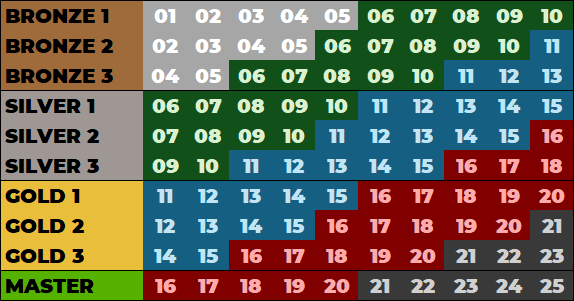

# What is the Ranked 2v2 gamemode?

Trackmania offers a skill-based Ranked matchmaking mode open to all players.
Matches are played in a tweaked version of the Trackmania World Tour gamemode, with a points limit of 10.

You can either queue solo or with up to another player.
When enabled, you can use voice chat to communicate with your teammate.

## The Ranked 2v2 gamemode explained

When you queue up for a Ranked 2v2 match, you will be matched with and against players from similar matchmaking ranks.
After a short warmup period once all players are connected, the match will start.

Every player starts at the same time, and teams earn points for their members' finishing positions.
In case a player disconnects from the match, only the best player from each team scores points.

Each round of a match will have three possible outcomes; Ace, Victory, and.

### Ace

|  Pos  |   Team   |
| :---: | :------: |
|  1st  |  A  |
|  2nd  |  A  |
|  3rd  |  B  |
|  4th  |  B  |

|  Team A gets  |  Team B gets  |
| :-----------: | :-----------: |
|   3 points    |   0  points   |

### Victory

|  Pos  |   Team   |
| :---: | :------: |
|  1st  |  A  |
|  2nd  |  B  |
|  3rd  |  A  |
|  4th  |  B  |

|  Team A gets  |  Team B gets  |
| :-----------: | :-----------: |
|   2 points    |   1  points   |

### Draw

|  Pos  |   Team   |
| :---: | :------: |
|  1st  |  A  |
|  2nd  |  B  |
|  3rd  |  B  |
|  4th  |  A  |

|  Team A gets  |  Team B gets  |
| :-----------: | :-----------: |
|   3 points    |   0  points   |

## Ranked map pool

Ranked 2v2 Matchmaking in Trackmania is played on the current Seasonal Campaign maps as well as on Trackmania World Tour maps (see [below](#tmwt-maps) for more information).

The map for your match will be randomly chosen out of the map pool based on the skill bracket of the lowest ranked player in the match.

The current campaign map pool distribution is as follows:

|  Skill bracket |   Map pool   |
|  :-----------: |  :---------: |
|    Bronze 1    | Maps 1 - 10  |
|    Bronze 2    | Maps 2 - 11  |
|    Bronze 3    | Maps 4 - 13  |
|    Silver 1    | Maps 6 - 15  |
|    Silver 2    | Maps 7 - 16  |
|    Silver 3    | Maps 9 - 18  |
|     Gold 1     | Maps 11 - 20 |
|     Gold 2     | Maps 12 - 21 |
|     Gold 3     | Maps 14 - 23 |
|     Master     | Maps 16 - 25 |

Note that maps 10, 15 and 25 are currently excluded from the 2v2 Matchmaking pool.

### TMWT maps

Three times a day (an hour after the daily COTD events happen), 2v2 Matchmaking uses the current Trackmania World Tour map pool instead of the Seasonal Campaign.

Note that this is only available to Gold and Master players and lasts for an hour before switching back to Seasonal Campaign maps.

## Matchmaking rating

When the match ends, players will earn or lose rating points depending on their performance.

| Overall player position | Points gained |
|:---:|:---:|
| 1st | +30 |
| 2nd | +15 |
| 3rd | -15 |
| 4th | -30 |

The player who scored the most points in the entire match, no matter whether they are on the winning or losing side, is the Match MVP and earns **10** bonus rating points.
Note that beginner players will experience a ranking boost in their first ten matches.

At the end of a matchmaking season (which runs in parallel to the campaign seasons), matchmaking ranks and ratings will be soft-reset to prevent the ratings at the top from becoming stale.

|   Before seasonal reset    |       After seasonal reset        |
| :------------------------: | :-------------------------------: |
|    Trackmaster/Master 3    |              Gold 3               |
|          Master 2          |              Gold 2               |
|          Master 1          |              Gold 1               |
|           Gold 3           | mid Silver 3 (around 1800 points) |
|           Gold 2           |             Silver 3              |
|           Gold 1           |             Silver 2              |
|          Silver 3          |             Silver 1              |
|          Silver 2          |             Bronze 3              |
| Silver 1/Bronze 3/Bronze 2 |             Bronze 2              |
|          Bronze 1          |             0 points              |
|      Inactive players      |             0 points              |

Note that inactive players are defined as players that have not played a Ranked match in the previous season.

At higher ranks, there is also an additional rank decay system. Note that you only lose points once you're out of immunity days.

|   Skill bracket   | Maximum immunity | Points change per day of inactivity |
| :---------------: | :--------------: | :---------------------------------: |
| Trackmania/Master |     10 days      |                 -20                 |
|       Gold        |     15 days      |                 -10                 |

When reaching each skill bracket, you're granted the maximum number of immunity days - you regain them by playing matches.

Authors: [Chris92](https://twitter.com/Chris92_de)/[tooInfinite](https://twitter.com/davidbmaier)
