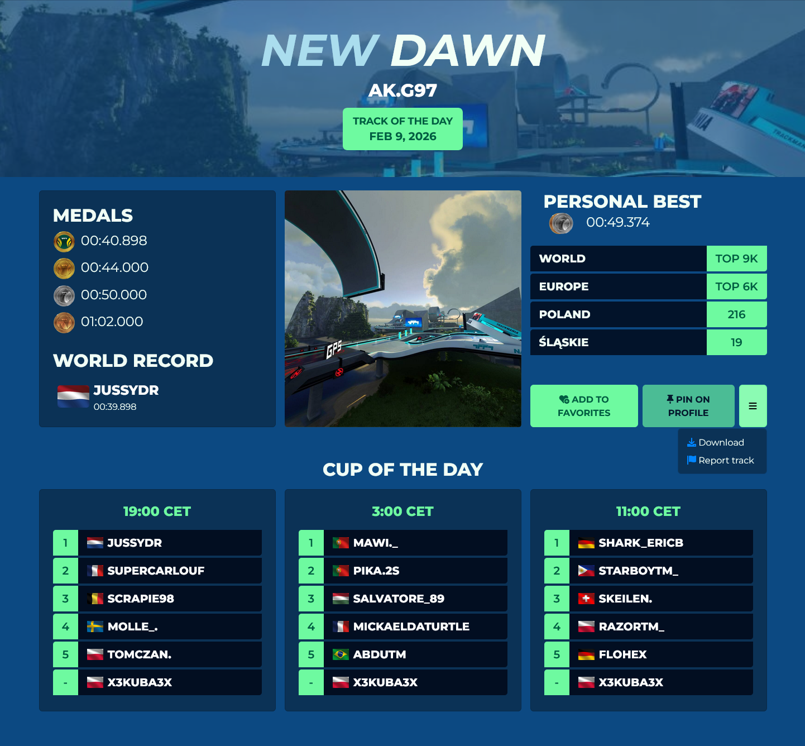
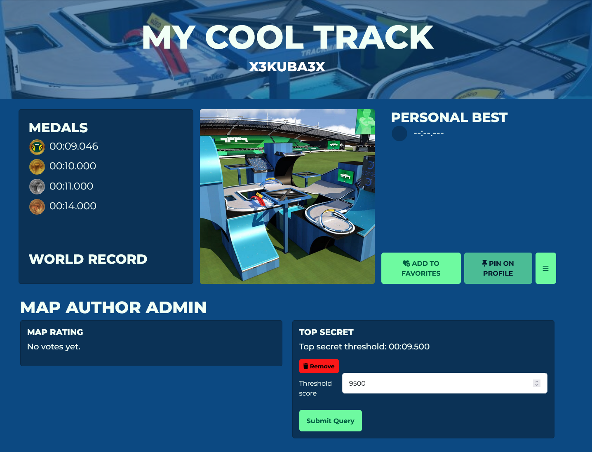

# Map Page

## Map Info

Checking the **Map page** will provide the user with a short overview of information about a map.

The banner contains the map name and the author. On official campaign and TOTDs there is an additional information displaying the map type and campaign season/TOTD date.

Information on the left part of the page depends on the track type:

- For Race type maps, this section displays the times of all medals as well as the world record.

- For Platform type maps, this section displays the max respawn count for all medals.

- For Stunt type maps, this section will display the points required for all medals as well as the world record.

The right side displays the user's statistics on the map (Personal best, World/Continent/Country/Region ranking) as well as buttons to add the map to Favorites, pin the map to the user's profile, download the map and report the map.

If the map is a TOTD, there will be another section at the bottom with the top 5 rankings and the user's placement for each Cup of the Day.

## Map author admin

If you are the author of the track, there will be two more sections below the map information.

The map rating section displays a percentage of likes and dislikes given by players on your map (not to be confused with map ratings in [Map Review](/web/tm-com/player-tracks#map-review)).

Using the top secret feature will allow you to hide records that are faster than a set time. The threshold has to be inputted in milliseconds (12500 -> 12.500s).

Any records faster than the set threshold will turn secret - on the leaderboard the timer will display **SECRET** and the ghost will be unwatchable. By default, any officially accepted Weekly short maps have this feature set to the author time until the next Weekly Shorts rotation comes.