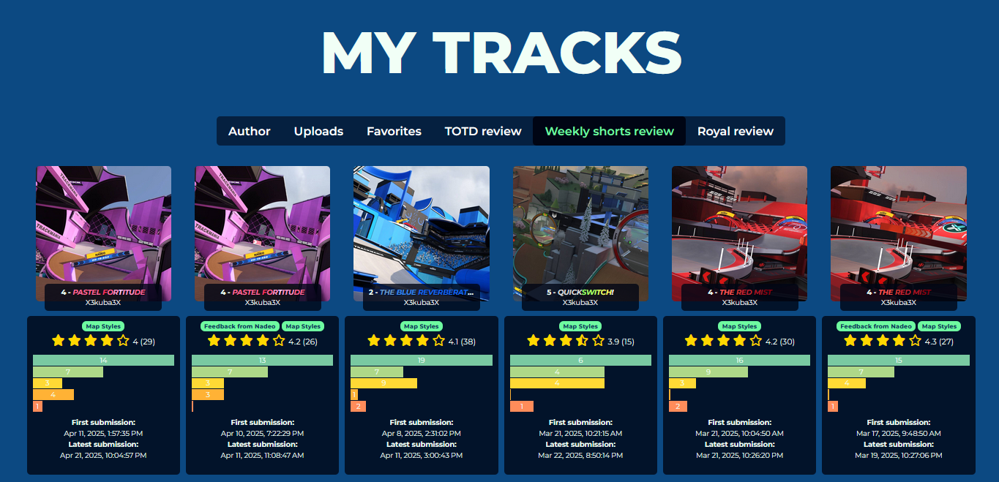
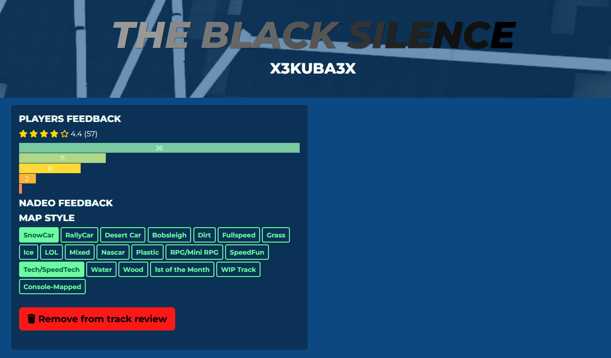

# Player Tracks

On this page you can manage any tracks uploaded to Nadeo services. Those tracks are unable to be deleted.

The **Author** tab contains all maps created by you. It does not matter who uploads the map to Nadeo services (for example via a club activity).

The **Uploads** tab contains maps that have been uploaded to Nadeo services by you.

The **Favorites** tab contains maps that you have marked as favorite either in game or [on the map page](/web/tm-com/map-page).

## Map review

Map review is split into three categories depending on the gamemode - TOTD Review, Weekly Tracks Review and Royal review.

Putting your map in [map review](/create/map-review/submit-your-map-to-map-review) will cause it to appear in the respective review section.

Each track shows a count of all the player votes. Maps that are reviewed by Ubisoft Nadeo or are open for a discussion get a special banner.

Opening the track page allows you to choose **map styles** as well as read any Nadeo Feedback labels. (read more here: [Weekly Short Labels](/create/map-review/weekly-shorts-guidelines/#introducing-labels-for-weekly-shorts-for-feedback-from-nadeo)/[Weekly Grand Labels](/create/map-review/weekly-grands-guidelines/#introducing-labels-for-weekly-grands-for-feedback-from-nadeo))

On this page you can also remove the track from Map Review - it is recommended to remove old versions if you end up updating your map.

